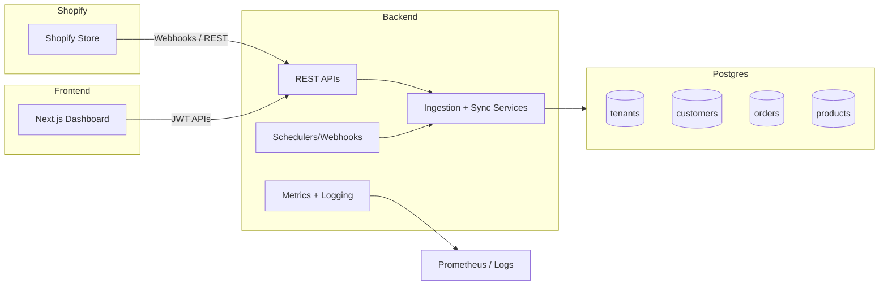

# Xeno Shopify Dashboard

Multi-tenant Shopify data ingestion backend (Spring Boot) with a Next.js dashboard for customer, order, and product insights. Built as the FDE internship assignment to demonstrate full-stack ownership: onboarding new stores, syncing Shopify data via REST/webhooks/schedulers, and surfacing KPIs with authentication.

## Live Demo
- **Frontend (Vercel):** https://xeno-shopify-g2d11ve1c-avijitpratapsin-2613s-projects.vercel.app/
- **Backend (Render):** https://xeno-shopify-peuv.onrender.com
- **Dashboard (local dev):** http://localhost:3000 (run from `frontend/`, see setup below)

## Repository Layout
- `backend/` – Spring Boot ingestion API + Render Docker deployment files
- `frontend/` – Next.js dashboard (available at https://github.com/Aviijeet12/Xeno-Shopify/tree/main/frontend)
- `docs/` – architecture notes, runbooks, deployment guides
- `render.yaml` – Render blueprint wiring backend + Postgres

## Highlights
- Tenant onboarding + JWT-protected APIs with role-based access.
- Shopify ingestion service pulls customers, orders, and products; scheduler + webhook endpoints keep data fresh.
- PostgreSQL schema isolates data per tenant and powers aggregate metrics (total revenue, top customers, orders timeseries, etc.).
- Production-ready concerns: Flyway migrations, structured logging, Prometheus metrics, Vault integration, Dockerfile + Render blueprint, CI workflow.

## Architecture


> Detailed architecture notes live in `docs/architecture.md`.

## Tech Stack
- **Frontend:** Next.js 15 + Tailwind + custom dashboard components
- **Backend:** Spring Boot 3.2, Spring Data JPA, Spring Security, WebClient, Flyway
- **Database:** PostgreSQL 15+ (tested against 18 on Render)
- **Tooling:** Maven, pnpm, Docker, Render, GitHub Actions, Testcontainers

## Getting Started
### Prerequisites
- Node.js 20+, pnpm 9+
- Java 17, Maven 3.9+ (or run `backend/scripts/install_maven_and_test.ps1` on Windows)
- PostgreSQL 15+ locally (or use Docker)

### Backend
1. `cp backend/.env.example backend/.env` and fill in:
   - `DB_*` pointing to your Postgres instance
   - `JWT_SECRET` (512-bit hex recommended)
   - Shopify credentials (host, API key/secret, `shpat…` access token, webhook secret)
   - Optional: override `ADMIN_EMAIL` / `ADMIN_PASSWORD` (default `admin@xeno.dev` / `ChangeMe123!`)
2. Start Postgres and run migrations automatically via Spring: `cd backend && mvn spring-boot:run`
3. On first boot an admin account is seeded from the env variables. Use `/auth/login` to retrieve a JWT and call authenticated APIs.

### Frontend (inside `frontend/`)
1. `cd frontend && pnpm install`
2. Create `frontend/.env.local` (see comments in `frontend/lib/api.ts` for base URLs—by default it hits `http://localhost:8080`).
3. `pnpm dev` (still inside `frontend/`) and open http://localhost:3000. Log in with the admin credentials, onboard a tenant, then open `/dashboard/{tenantId}`.

### Demo Tenant Data
The ingestion service now serves curated dummy datasets when certain domains are onboarded—handy for showcasing multi-tenant UX without hitting live Shopify stores.

- **Fashion (existing sample):** any domain without the keywords below behaves like the default apparel store.
- **Home Decor:** onboard a store whose domain contains `decor` or `home` (for example, `home-decor-demo.myshopify.com`). Syncing the tenant populates sofa/lighting/rugs products from `backend/src/main/resources/mock-data/mock-tenants.json`.
- **Tech Gadgets:** domains containing `tech` or `gadget` (e.g., `tech-gadgets-lab.myshopify.com`) receive smart-speaker/headset inventory and matching customers/orders.

Run `POST /api/tenants/{tenantId}/sync` (or use the UI “Sync” action) after onboarding to load the correct dataset for each tenant.

## API Quickstart
```bash
# 1. Login (admin seeded from env)
curl -X POST "$BASE_URL/auth/login" \
  -H "Content-Type: application/json" \
  -d '{"email":"admin@xeno.dev","password":"ChangeMe123!"}'

# 2. Onboard a tenant
curl -X POST "$BASE_URL/api/tenants/onboard" \
  -H "Authorization: Bearer <jwt>" \
  -H "Content-Type: application/json" \
  -d '{"shopDomain":"demo.myshopify.com","accessToken":"shpat_xxx","contactEmail":"ops@shop.com"}'

# 3. Trigger sync (optional)
curl -X POST "$BASE_URL/api/tenants/{tenantId}/sync" -H "Authorization: Bearer <jwt>"
```
Full endpoint reference lives in `docs/architecture.md`.

## Deployment
- Dockerfile + multi-stage build: `backend/Dockerfile`
- Render blueprint: `render.yaml` (provisions Postgres + Docker web service)
- Deployment steps + environment matrix: `docs/render-deploy.md`
- CI: `.github/workflows/ci.yml` runs Maven tests via Testcontainers (skips when Docker unavailable)

## Testing
```bash
# Backend unit/integration tests
cd backend
mvn -B test

# Or run helper script on Windows (installs Maven 3.9.6 and runs tests)
powershell -File backend/scripts/install_maven_and_test.ps1
```
TenantRepositoryTest automatically skips when Docker/Testcontainers aren’t present.

## Known Limitations
- Demo store seeded manually; Shopify webhooks require a public URL (already covered by Render).
- Frontend uses mock trend percentages for certain cards; extend `lib/api.ts` to incorporate historical metrics if desired.
- Authentication is email/password only; add OAuth or SSO for production.

## Further Reading
- `docs/architecture.md` – assumptions, architecture diagram, API/data model deep-dive, next steps.
- `docs/secrets.md` – handling secrets with `.env` vs Vault.
- `docs/runbooks.md` – operational playbooks.
- `docs/render-deploy.md` – Render blueprint walkthrough.
- `docs/render-deploy.md` + demo video instructions (see assignment README for deliverables).
