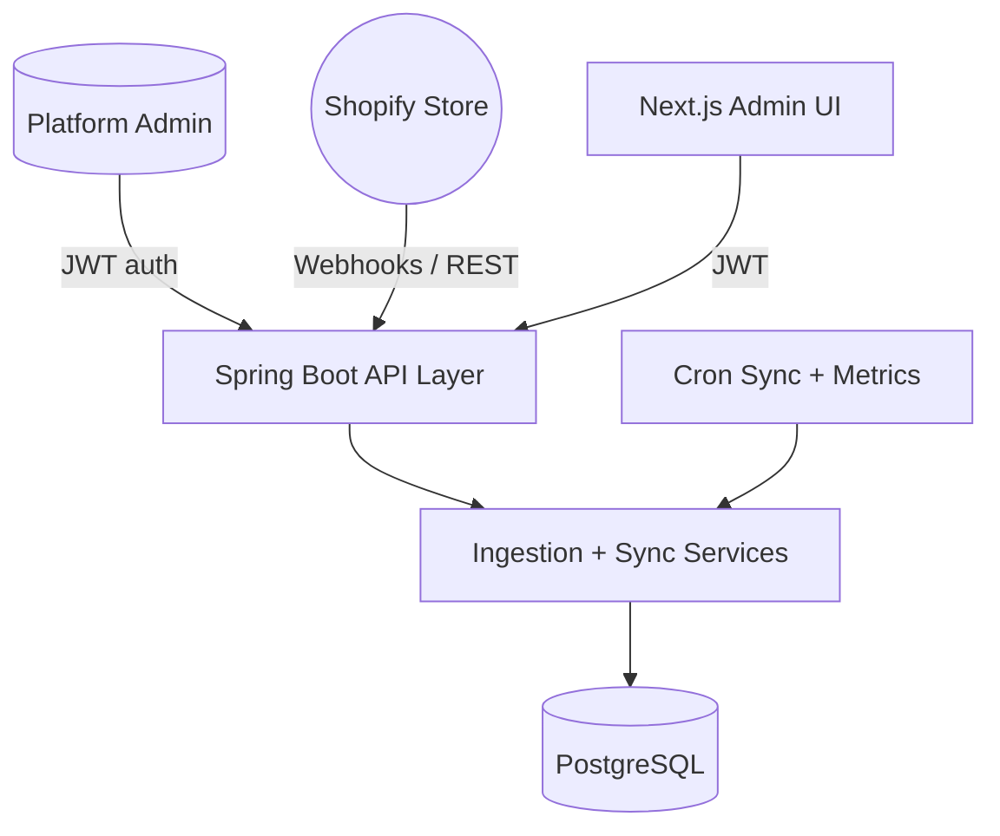

# Architecture & Implementation Notes

## Assumptions
- Each Shopify tenant exposes a long-lived private app access token (`shpat_…`). OAuth flow is out-of-scope for the assignment, so onboarding accepts the token directly.
- A platform operator (seeded admin user) performs tenant onboarding and user management. Tenants may optionally self-serve once invited.
- Postgres is the system of record; analytical queries required by the dashboard stay within OLTP tolerances for the assignment scale.
- Render provides a managed Postgres instance and public ingress for Shopify webhooks.

## High-Level Architecture

- **API Layer:** Spring MVC controllers handle onboarding, tenant CRUD, sync triggers, and webhook ingestion with validation + error envelopes.
- **Service Layer:** `ShopifyClient` (WebClient) wraps Shopify REST calls with retries, rate-limit handling, and structured logging. `ShopifyIngestionService` persists customers/orders/products through repositories scoped by tenant id.
- **Persistence:** Flyway migration `V1__initial_schema.sql` defines tenant-keyed tables. Each table references `tenant_id` with cascading deletes to avoid data leakage.
- **Observability & Resilience:** Micrometer/Prometheus export, logback JSON logs, retry/backoff policies, and configurable timeouts ensure production readiness.
- **Sync Model:** Combination of scheduled pulls (`TenantSyncScheduler`) and webhook endpoints so data lands quickly but also reconciles on a cadence.

## Data Model Snapshot
| Table | Purpose | Key Columns |
| --- | --- | --- |
| `tenants` | Registered Shopify stores | `id (UUID)`, `shop_domain`, `access_token`, `last_sync_at` |
| `users` | Platform + tenant admins | `email`, `password_hash`, `role`, `tenant_id (nullable)` |
| `customers` | Shopify customers per tenant | `tenant_id`, `shop_customer_id`, `total_spent` |
| `orders` | Shopify orders per tenant | `tenant_id`, `shop_order_id`, `total_price`, `currency` |
| `products` | Shopify catalog items per tenant | `tenant_id`, `shop_product_id`, `price` |

Multi-tenancy is enforced through explicit `tenant_id` columns, repository filters, and JWT claims (users carry their tenant id on login). Platform admins (role `PLATFORM_ADMIN`) can onboard tenants without being tied to one tenant.

## API Surface (summary)
| Method | Path | Description | Auth |
| --- | --- | --- | --- |
| POST | `/auth/login` | Email/password login (admin + tenant users) | Public |
| POST | `/auth/register` | Invite/register tenant-scoped users | JWT (admin) |
| POST | `/api/tenants/onboard` | Register Shopify shop + token | JWT (platform admin) |
| GET | `/api/tenants` | List tenants | JWT |
| GET | `/api/tenants/{id}` | Tenant detail | JWT |
| DELETE | `/api/tenants/{id}` | Remove tenant (cascades data) | JWT |
| POST | `/api/tenants/{id}/sync` | Trigger ad-hoc ingestion | JWT |
| POST | `/api/webhooks/*` | Receives Shopify webhooks (orders/customers/etc.) | Public with HMAC verification |
| GET | `/actuator/*` | Health/metrics endpoints | Public (health), auth for detailed metrics |

Frontend consumes a consolidated `/api/metrics/overview`, `/api/metrics/orders`, etc. (see `lib/api.ts`) to drive cards, charts, and tables.

## Sync & Scheduling Strategy
1. **Manual/On-demand Sync:** Immediately after onboarding or via `/api/tenants/{id}/sync`, `ShopifyIngestionService` uses the access token to pull latest customers/orders/products.
2. **Scheduled Sync:** `TenantSyncScheduler` runs at a configurable cadence (cron) and iterates through active tenants, producing metrics stored per tenant.
3. **Webhooks:** `/api/webhooks/**` endpoints capture Shopify events (orders, customers) and feed them into the same ingestion pipeline for near-real-time updates.

## Next Steps (Production Hardening)
- Replace direct token entry with OAuth (Shopify Admin installs app → we receive code → exchange for token).
- Introduce a streaming pipeline (e.g., Kafka) plus worker pods to process large tenant volumes asynchronously.
- Add role-aware scopes so tenant admins can manage their own users while platform admins oversee everything.
- Build historical aggregates table to calculate rolling metrics (AOV trend, revenue vs. LY) efficiently.
- Expand automated tests around controllers/services plus contract tests for the Shopify client (WireMock).
- Integrate Redis for caching Shopify rate-limit state and dashboard responses.
- Add feature flags + alerting around sync failures (PagerDuty, Slack webhooks).
